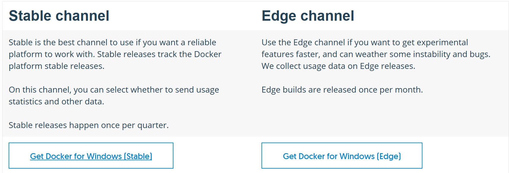
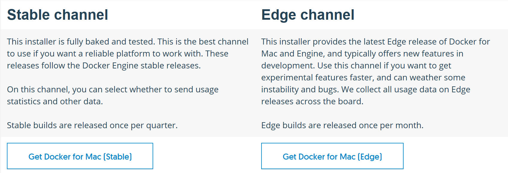
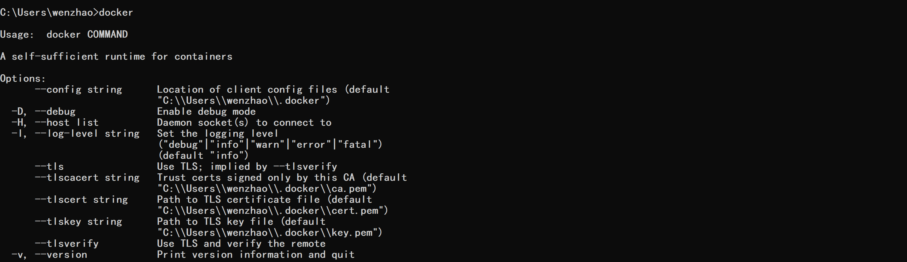

## 前期准备工作
1. Azure账号  

确保自己可以登陆global Azure账号并有订阅；

2. 安装Azure CLI 2.0:  

https://docs.microsoft.com/en-us/cli/azure/install-azure-cli?view=azure-cli-latest  

如果是windows 用户，由于Azure cli最新版本2.0.24还有些小问题，我们用Azure cli2.0.23进行实验，下载地址为:  

https://github.com/DandelionWenjing/azurecli2.0.23  

3. 安装docker:  

Install docker for windows:  

https://docs.docker.com/docker-for-windows/install/#download-docker-for-windows  

install docker for Mac:  

https://docs.docker.com/docker-for-mac/install/  

  

Install docker for Linux:  

https://docs.docker.com/engine/installation/linux/docker-ee/ubuntu/#set-up-the-repository  

  

安装完成后在命令行输入docker:  

确认是否完成安装。
 

