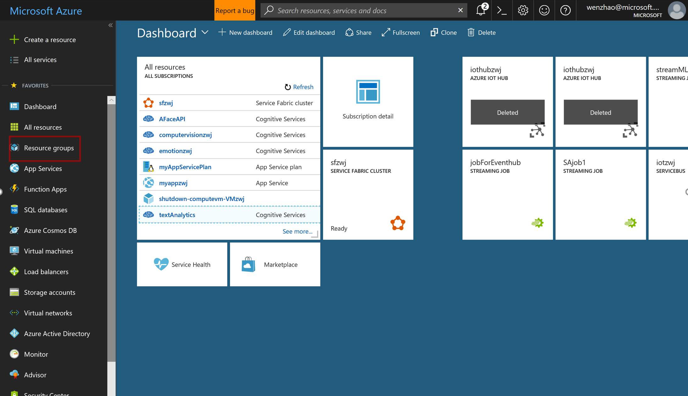

## 使用Azure Container Service 创建kubernetes 集群

#### 使用az命令行工具  

打开cmd窗口，在本文档中我们较多使用Azure CLI工具来进行Azure服务的部署，命令为 “az”:  

#### 设定对global Azure进行操作:  

（如果是mooncake Azure, --name选择AzureChinaCLoud） 

```
az cloud set --name AzureCloud
```

#### 登陆Azure账号：  

```
az login
```  
  

将网址输入浏览器，出现如下界面：  
  

将代码输入到代码框中:  
 
 
登陆自己的账号:  
   
 
出现如下界面登陆成功：
   

登陆成功后cmd界面显示如下:  


#### 请求订阅上的功能标记：  

```
az provider register -n Microsoft.ContainerService
```
  

#### 创建资源组：  

创建资源组来放k8s集群:  

-n <集群名称> -l <集群创建地域>  

```
az group create -n K8SCluster -l eastus
```  

创建结果如下：


#### 在Azure上创建kubernetes集群:  

在刚创建的资源组中创建Kubernetes集群：  

-g <资源组名称> -c <节点数量> --generate-ssh-keys <表示新建ssh key在本地> -k <版本信息>

（默认情况下k8s的版本为1.7.7，也可以增加新的参数-k来确认版本）  

```
az aks create -g K8SCluster -n K8SDeployment -c 1 -k 1.7.7 --generate-ssh-keys
```  
创建结果如下：


####  Azure portal后台查看：  

建立此集群可能需要5分钟来建立，这取决于创建节点数量等因素。  

创建完成后我们可以进入Azure portal查看后台的创建操作：  

进入浏览器输入如下网址并登陆自己的Azure账号：  
```
portal.azure.com
```

点击左侧资源组按钮，查看新建的资源组信息：  

  

可以看到我们新建的资源组出现在portal中，同时有一个MC开头的资源组一起创建(如果还没有可以等待一下之后点击上方refresh进行刷新)：  

  
 
点击K8SCluster资源组，我们可以看到我们部署的容器服务资源对象：  

  
 
进一步进入部署的资源对象中：  

 
 
这里我们可以看到资源组的信息：  

包括部署的地点，kubernetes的版本号，agent节点的个数，agent虚机的大小等等。  

同时还有API server address,假如我们需要将AKS资源与jenkins/VSTS等做devops的工具进行连接的话需要用到该地址与API server相连。  

现在我们进入另一个MC开头的资源组，这个资源组是包含了我们创建服务得所有实体对象得资源组： 

    
 
包括虚拟网络，路由表，网络安全组，以及agent节点等等；  

这时我们已经在相应得节点上安装好了kubeDNS, heapster以及kubelets使得kubernetes集群已经可以直接工作了。  


