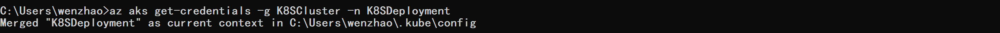

## 管理kubernetes 集群  

#### 安装kubectl:  

查看本地kubectl是否已经安装，如果未安装，安装kubectl并添加路径:  

Windows下kubectl安装地址：  

https://storage.googleapis.com/kubernetes-release/release/v1.8.0/bin/windows/amd64/kubectl.exe  

#### 配置Kubectl连接到k8s集群：  

```
az aks get-credentials -g K8SCluster -n K8SDeployment
```
默认会下载kube config文件在~/.kube/config中。  



config文件保存了Kubernetes集群的信息，当我们执行kubectl命令时，会默认对相应的AKS集群进行操作。  

* 【如果在获取该命令的时候出现如下的错误，可能跟CLI的版本相关，更新一下CLI的版本再进行尝试】：  
```
No Kubernetes access profiles found. Cluster provisioning state is "Succeeded".
```
下载Azure CLI 2.0.23：  

https://azurecliprod.blob.core.windows.net/msi/azure-cli-2.0.23.msi  

安装新版本Azure CLI后再次执行如上命令进行尝试。

新的集群信息会merge进kube config file中。  

如果您使用minikube 进行该操作应该获得相同的结果。  

#### 列出订阅下所有的AKS集群信息：  

```
az aks list -o table
```

列出结果如下：  
  

#### 获取集群节点情况：  

我们可以通过如下命令获取Kubernetes中的虚机节点nodes的创建情况：

```
kubectl get nodes
```
结果如下：  
  

可以看到在该集群中，我们创建了一个agent node，这里可以看到agent node的信息，默认命名前缀包括这个agent node所在的agent pool;  

#### 集群的管理：  

获取kubernetes基本单位pods的所有信息(kubernetes中有不同的namespace,这里我们选择所有的namespace)：  
```
kubectl get pods --all-namespaces
```
结果如下：  
  

我们可以看到在现有的kubernetes集群中已经存在的基本pods信息。  

这里包括有heapster做监控, kubeDNS, kube proxy等;  

#### 登陆kubernetes dashboard:  

通过该命令我们可以打开kubernetes的dashboard查看集群的状态
```
az aks browse -g K8SCluster -n K8SDeployment
```
结果如下：
  

登陆网址127.0.0.1:8001即可看到kubernetes的dashboard（也可能会自动弹出）:
  

它会自动创建一个通道，自动打开这个dashboard,如果你对kubernetes的dashboard非常熟悉和适应的话，有很多操作可以直接在dashboard上面进行。  

只要这个tunnel建立起来了，我们就可以直接在k8s的dashborad上面操作。  

如果想要离开这个dashboard,可以CRTL+C来关闭这个通道。  

### 对AKS集群做扩展：
```
az aks scale -g K8SCluster -n K8SDeployment -c 3
```

我们将集群中1个节点扩展到了3个节点，这一过程可能需要花费5分钟的时间。  

但是在portal中，我们很快可以看到新建起来的虚机以及挂载在上面的磁盘：
 
 
扩展完成后会看到如下结果：
 


####	获取kubernetes版本信息：  

如下命令可以告诉我们现在的版本信息以及可以升级的版本信息：  
```
az aks get-versions -g K8SCluster -n K8SDeployment -o table
```
结果如下：
 


#### 做kubernetes升级：

将当前kubernetes版本升级到更高版本：
```
az aks upgrade --name K8SDeployment --resource-group K8SCluster --kubernetes-version 1.8.2
```

这个步骤可能需要花费一定的时间，大约需要二十分钟，如果您时间紧张可以忽略掉该升级步骤；  

在升级过程中会提示unavailable，但是现有的服务不会go down，只是不能部署新服务到集群中。

#### 确认是否升级成功：

列表得到kubernetes集群当前版本信息：
```
az aks show --name K8SDeployment --resource-group K8SCluster --output table
```


