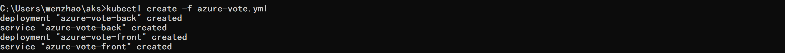
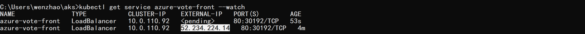
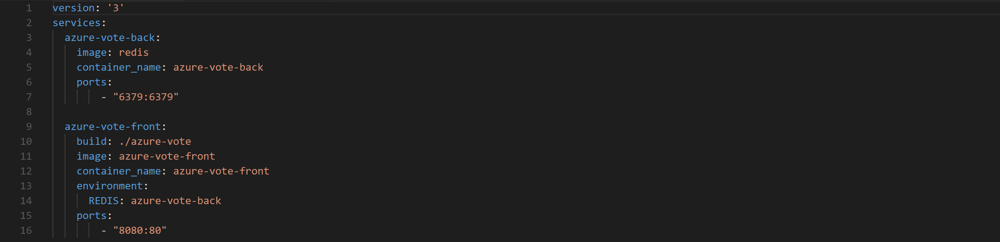
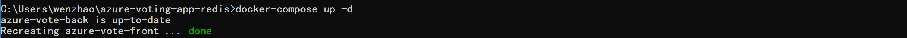
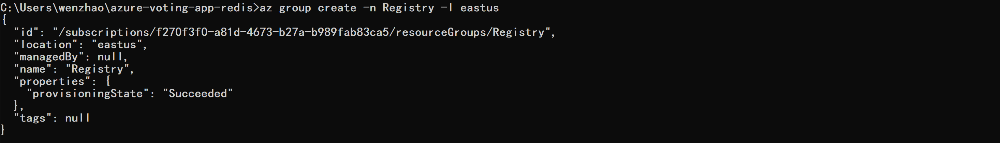
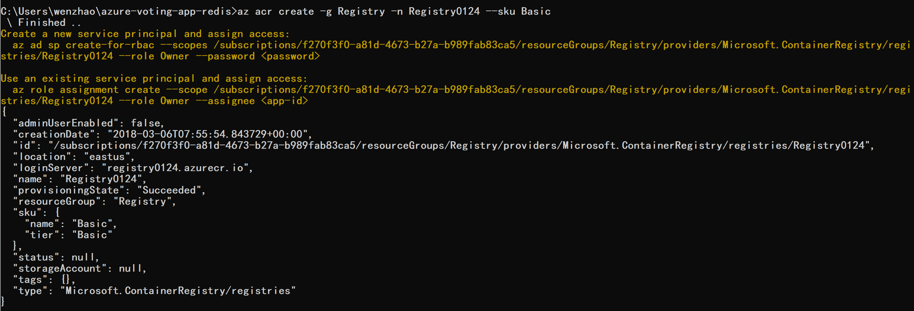
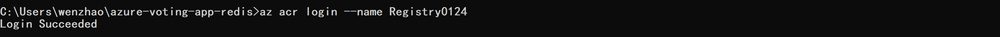
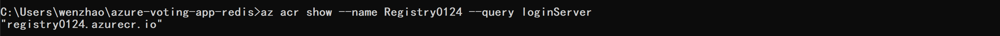
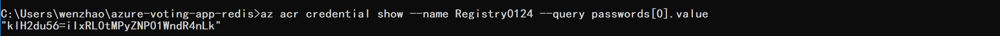

## 部署容器化应用到Kubernetes集群中

### 从docker hub拉取镜像进行部署

示例应用程序是一个投票程序，包含前端和后端。  

kubernetes会根据yaml文件中的配置进行应用程序的部署，所以yaml文件非常重要。  

我们下载现有的yaml文件，包含资源对象deployment和service， 做k8s的部署。  

#### 下载文件azure-vote.yml：  

从github下载包含了前端和后端的service和deployment:  

```
git clone https://github.com/DandelionWenjing/aks.git
```

#### 根据文件创建部署和服务： 

```
cd aks
kubectl create -f azure-vote.yml
```
得到结果如下：



#### 测试应用程序在云端运行情况：  

```
kubectl get service azure-vote-front --watch
```
  

azure-vote-front的服务会暴露对外的IP地址，通过该IP地址我们可以使用该应用程序的服务。  

浏览器中输入EXTERNAL-IP可以得到应用程序的运行界面：  
 
 
监视完成之后可以ctrl+c停止监视。  


### 打包应用程序到镜像仓库并进行部署

接下来我们对自定义应用程序进行打包，创建应用程序镜像，将镜像推到镜像仓库中，再使用aks从Azure的镜像仓库中把镜像部署到kubernetes集群中。  

#### 将应用程序下载到本地：

```
git clone https://github.com/Azure-Samples/azure-voting-app-redis.git
cd azure-voting-app-redis
```

#### 用compose文件创建容器镜像：

查看docker-compose.yml:
  

最后的ports是绑定本地8080端口到容器的80端口， 如果本地的8080端口被占，可以更换成其他的端口。  

使用如下命令进行容器构建：
```
docker-compose up -d
```
 

使用http://localhost:8080测试，如果8080端口被占了的话就换端口号。  

 

#### 创建Azure Container Registry:

创建Azure容器注册表， 该注册表类似于镜像仓库， k8s可以从该镜像仓库将镜像部署到容器集群中。  

##### 创建ACR资源组:  
```
az group create -n Registry -l eastus
```

  

##### 创建Azure容器注册表：  
```
az acr create -g Registry -n Registry0124 --sku Basic
```
 

##### 登陆容器注册表：  
```
az acr login --name Registry0124
```
 

【注意登陆的时候要保证docker正常运行， 并且用非normal的cmd可能会出现incorrect function.】  

##### 显示loginserver和密码：  
```
az acr show --name Registry0124 --query loginServer
```
 

```
az acr credential show --name Registry0124 --query passwords[0].value
```
 

##### 将镜像打标签推送到镜像仓库：
```
docker tag azure-vote-front registry0124.azurecr.io/azure-vote-front:redis-v1
docker push registry0124.azurecr.io/azure-vote-front:redis-v1
docker images
```

REPOSITORY                                 TAG                 IMAGE ID            CREATED             SIZE
azure-vote-front                           latest              8a011828251c        33 minutes ago      935MB
registry0124.azurecr.io/azure-vote-front   redis-v1            8a011828251c        33 minutes ago      935MB
tiangolo/uwsgi-nginx-flask                 python3.6           cb32ec9f1c26        3 weeks ago         935MB
redis                                      latest              1e70071f4af4        4 weeks ago         107MB

##### 返回推送到容器注册表的结果：
```
az acr repository list --name Registry0124 --output table
```
az acr repository list --name Registry0124 --output table
Result
----------------
azure-vote-front

运行应用程序：
下面再将应用程序部署到容器集群上，与之前从docker hub拉镜像不同的是，这次我们是从registry里面拉镜像，所以把镜像拉取地址换成registry的loginserver;
进入voting文件夹下，部署相应的service和deployment：
kubectl create -f azure-vote-all-in-one-redis.yml
 
后续步骤有关如何查看service，找IP，与之前类似；


管理应用程序：
•	缩放pods:
这里我们只看默认namespace下面的pods情况；
kubectl get pods –all-namespaces
kubectl get pods --all-namespaces
NAMESPACE     NAME                                                         READY     STATUS    RESTARTS   AGE
default       azure-vote-back-4149398501-xfjn6                             1/1       Running   0          5h
default       azure-vote-front-1874756303-j6wsj                            1/1       Running   1          17h
default       jazzy-macaw-nginx-ingress-controller-1444582388-gj5qm        1/1       Running   1          17h
default       jazzy-macaw-nginx-ingress-default-backend-3715337617-xxzdp   1/1       Running   0          5h
kube-system   heapster-342135353-ph7tq                                     2/2       Running   2          17h
kube-system   kube-dns-v20-1654923623-h4jrb                                3/3       Running   3          17h
kube-system   kube-dns-v20-1654923623-jz4lv                                3/3       Running   0          5h
kube-system   kube-proxy-7nslj                                             1/1       Running   0          5h
kube-system   kube-proxy-gmrr8                                             1/1       Running   1          17h
kube-system   kube-proxy-vmfhv                                             1/1       Running   1          17h
kube-system   kube-svc-redirect-wp5qw                                      1/1       Running   1          17h
kube-system   kube-svc-redirect-wqbst                                      1/1       Running   1          17h
kube-system   kube-svc-redirect-zk2pg                                      1/1       Running   0          5h
kube-system   kubernetes-dashboard-6fc8cf9586-fs62j                        1/1       Running   2          17h
kube-system   tiller-deploy-352283156-hdl8b                                1/1       Running   0          5h
kube-system   tunnelfront-748d6946db-jm7ph                                 1/1       Running   1          17h

可以看到建立号集群后Pods中只有kube-system namespace下面创建的系统pods,而在我们进行部署后，default namespace下面就会有我们部署成功的pods显示。
有两次部署，所以这里是不同的front和back的pods；
•	扩展pods数量：
kubectl scale --replicas=5 deployment/azure-vote-front
kubectl scale --replicas=5 deployment/azure-vote-front
deployment "azure-vote-front" scaled

kubctl get pods
kubectl get pods
NAME                                                         READY     STATUS              RESTARTS   AGE
azure-vote-back-4149398501-xfjn6                             1/1       Running             0          5h
azure-vote-front-1874756303-778wg                            0/1       ContainerCreating   0          8s
azure-vote-front-1874756303-j6wsj                            1/1       Running             1          17h
azure-vote-front-1874756303-k8qpd                            0/1       ContainerCreating   0          8s
azure-vote-front-1874756303-mswvz                            0/1       ContainerCreating   0          8s
azure-vote-front-1874756303-sdv6f                            0/1       ContainerCreating   0          8s
jazzy-macaw-nginx-ingress-controller-1444582388-gj5qm        1/1       Running             1          17h
jazzy-macaw-nginx-ingress-default-backend-3715337617-xxzdp   1/1       Running             0          5h

•	自动缩放pods:
根据CPU利用率或者其他指标可以自动缩放Pods:
kubectl autoscale deployment azure-vote-front --cpu-percent=50 --min=3 --max=10
kubectl autoscale deployment azure-vote-front --cpu-percent=50 --min=3 --max=10
deployment "azure-vote-front" autoscaled

若CPU利用率超过50%，则扩展到10个pods;
查看自动缩放状态：
kubectl get hpa
kubectl get hpa
NAME               REFERENCE                     TARGETS           MINPODS   MAXPODS   REPLICAS   AGE
azure-vote-front   Deployment/azure-vote-front   <unknown> / 50%   3         10        5          44s

这样设置的结果为：
当CPU利用率达到50%以上，pod扩展成10个，当CPU利用率处于最小负荷状态几分钟后，pod缩成3个。
更新应用程序：
更新应用程序即更新它的镜像；
更新过程包括：更新代码->打包镜像->推送到镜像仓库->更新部署
•	更新应用程序前端文字：
更新config_file.cfg文件：该文件是前端文件；
文件地址为：azure-voting-app-redis\azure-vote\azure-vote
•	重新创建前端镜像：
docker-compose up –-build -d
--build表示重新创建镜像；
-d表示在backgroud运行容器；
•	测试容器是否运行成功：
 

•	重新标记和推送镜像仓库：
docker tag azure-vote-front registry0124.azurecr.io/azure-vote-front:redis-v2
 
推送镜像：
docker push registry0124.azurecr.io/azure-vote-front:redis-v2


