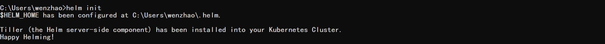

## 在部署过程中使用helm工具

#### Helm的安装:  

Helm是一个包管理器；可以安装一些打包好的系统或者应用程序包。  

Helm有两个部分，一个是client端叫helm,另一个是server端叫Tiller.  

我们首先需要安装helm和tiller:  

Helm github 安装文档：  

https://github.com/kubernetes/helm/blob/master/docs/install.md  

Helm release 地址：  

https://github.com/kubernetes/helm/releases  

安装完成之后在命令行中尝试helm是否正确安装。
```
helm init
```
  


这时我们查看一下在kubenetes集群里面的系统pod,可以发现有Helm server:Tiller:
```
kubectl -n kube-system get pod
```
 

#### 使用helm构建程序：  

这里我们可以使用helm来部署ingress-controller 到 AKS集群中;

安装来源于下列地址的nginx-ingress controller的文件：  

https://github.com/kubernetes/charts/tree/master/stable/nginx-ingress

安装稳定版本ingress-controller:
```
helm install stable/nginx-ingress
```


#### 查看安装情况：
```
helm list
```


不论我们部署什么服务到kubernetes中，只要这个服务有Load balancer 的type:  

那么这个服务就会自动调用Azure API创建一个load balancer，暴露一个公共IP给这个服务。这个服务会自动创建一个负载均衡规则。  

我们现在再回到portal上面去看，就会看到一个名叫kubernetes的load balancer;
 

 
