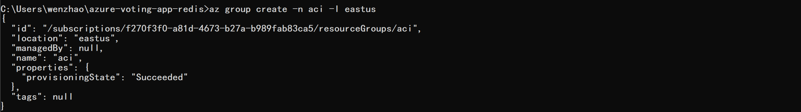
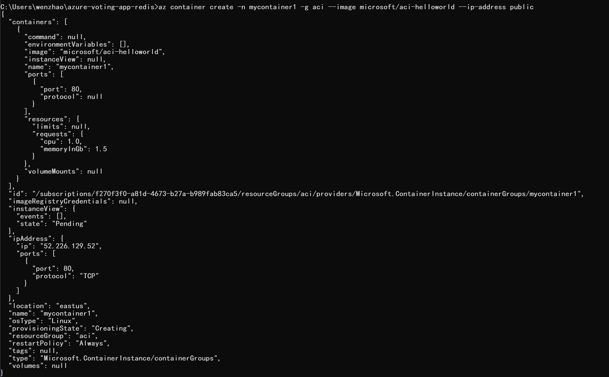
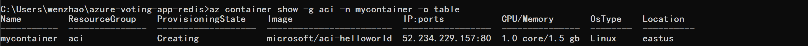
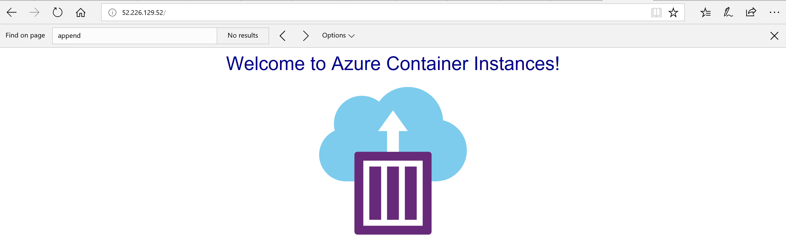
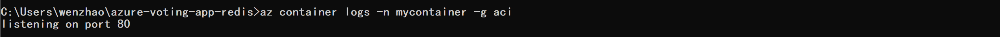
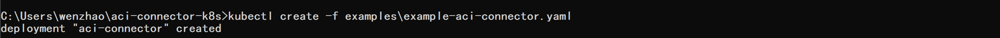
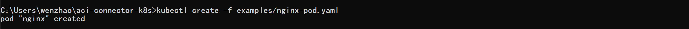

## 使用Azure Container Instance 

#### 创建ACI资源组： 
```
az group create -n aci -l eastus 
```
  

#### 利用现有镜像创建名叫 mycontainer 的 ACI:   
```
az container create -n mycontainer1 -g aci --image microsoft/aci-helloworld --ip-address public 
```
  
 
#### 列表显示： 
```
az container show -g aci -n mycontainer1 -o table 
```
 

#### 网页显示：
```
curl 52.170.248.91 
```
 
#### 打印log:  
```
az container logs -n mycontainer -g aci 
```
 

#### aci-connector:   

将 aci 更好的结合进 k8s 中。   

* 下载 aci-connector 源码：   
```
git clone https://github.com/Azure/aci-connector-k8s.git   
cd aci-connector-k8s
```
* 创建 aci-connector pod:   
```
kubectl create -f examples/example-aci-connector.yaml 
```


* 获取 pods 信息：   
```
kubectl get pods 
```
  

* 创建 nginx pod: 
```
kubectl create -f examples/nginx-pod.yaml 
```
 

```
kubectl get pods 
```

kubectl get pods -w 
详细列出 namespace 中所有 pods 的信息: 
kubectl get pods -o wide 
可以看到 nginx pod 在 aci-connector node 中。 
curl <nginxs-ip> 
 
 