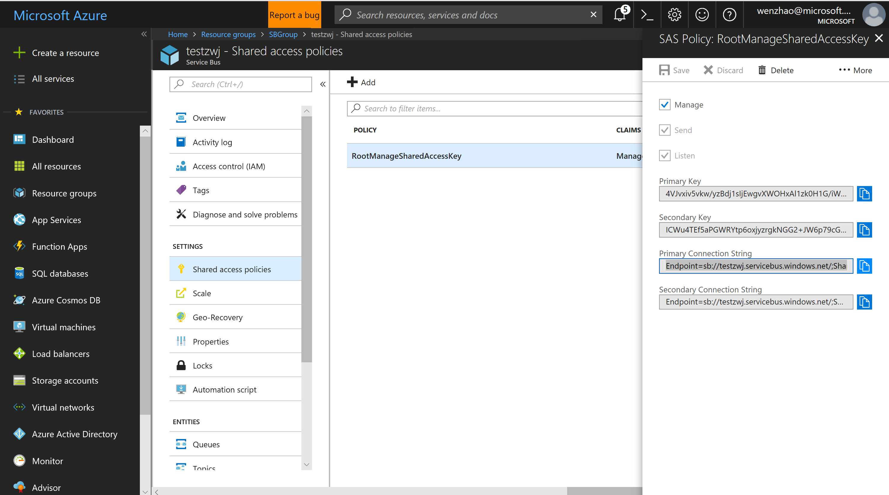

## 微服务应用的构建和部署

#### 进入微服务应用, 在多个服务文件夹下用dockerfile构建镜像：
```
cd Microservices\StickerStore
docker build -t registry0124.azurecr.io/webstore:1.0.0 Webstore/.
docker build -t registry0124.azurecr.io/statusservice:1.0.0 StatusService/.
docker build -t registry0124.azurecr.io/printingservice:1.0.0 PrintingService/.
docker build -t registry0124.azurecr.io/orderservice:1.0.0 OrderService/.
```

#### 构建完成后将镜像推进容器注册表中：
```
docker push registry0124.azurecr.io/webstore:1.0.0
docker push registry0124.azurecr.io/printingservice:1.0.0
docker push registry0124.azurecr.io/statusservice:1.0.0
docker push registry0124.azurecr.io/orderservice:1.0.0
```
#### 查看ACR列表：
```
az acr repository list --name Registry0124 --output table 
```


#### 创建服务总线：

在Azure portal上创建服务总线：  

  

获取服务总线connection string:

  

点击网站：https://www.base64encode.org/  

进行编码转换，将转换后的连接字符串填写到secret.yaml中。

在Azure Portal上创建Storage account:

  

获取 storage connection string:  

 

同理进行编码转换后将字符填写到secret.yaml中

#### 创建一个 secert deployment:  
```
cd deployment
kubectl create -f secret.yaml
```
  

#### 部署应用程序的所有服务：  
```
kubectl create -f deploy.yaml
```

#### 扩展 printing service 到 10个
```
kubectl scale --replicas 10 deployment printingservice-deployment
```

#### 缩小 printing service 到 1个
```
kubectl scale --replicas 1 deployment printingservice-deployment
```

#### 更新 printing service 版本：  
```
cd PrintingService
```
更改printing服务的前端文件中68行： version版本更改；  

```
docker build -t registry0124.azurecr.io/printingservice:1.0.0 PrintingService/.

docker push registry0124.azurecr.io/printingservice:1.0.1

kubectl set image deployment/printingservice-deployment printingservice=registry0124.azurecr.io/printingservice:1.0.1

kubectl rollout history deployment/printingservice-deployment

kubectl rollout undo deployment/printingservice-deployment --to-revision=1  
```